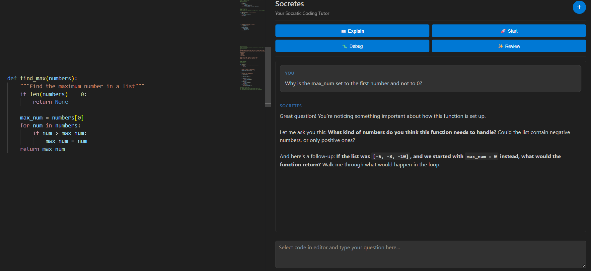

# Socretes - Your Socratic Coding Assistant

Socretes is a VS Code extension that helps students learn programming through Socratic questioning instead of giving direct answers. It acts as a patient coding tutor that guides students to discover solutions themselves.



## Features

Socretes provides 4 distinct learning modes, all accessible from the right-click context menu when you have code selected:

### 1. Explain This Code
- **Use when:** You don't understand code you're reading
- **What it does:** Asks you Socratic questions to help you figure out what the code does before explaining it
- **Example questions:** "What do you think this line does?" "Why do you think the programmer used this approach?"

### 2. Help Me Start
- **Use when:** You have an assignment but don't know how to begin
- **What it does:** Guides you through planning with questions about inputs/outputs, data structures, and breaking down the problem
- **Example questions:** "What are the inputs and outputs?" "What data structure makes sense here?"

### 3. Debug This
- **Use when:** Your code has a bug and you can't find it
- **What it does:** Asks Socratic questions to help you discover the bug yourself
- **Example questions:** "What do you expect this variable to be?" "Can you trace through the loop?"

### 4. Review My Code
- **Use when:** Your code works and you want to improve it
- **What it does:** Asks questions about edge cases, efficiency, and design choices
- **Example questions:** "What edge cases did you consider?" "Could this be more efficient?"

## Installation & Setup

### For Users

**See [STUDENTS_GUIDE.md](STUDENT_GUIDE.md) for complete installation guide.**

Quick steps:
1. Download `socretes-0.0.1.vsix`
2. Open VS Code → Extensions → `...` → "Install from VSIX..."
3. Get an API key from [console.anthropic.com](https://console.anthropic.com/)
4. Configure it in Settings

### For Developers

1. Clone this repository
2. Run `npm install`
3. Run `npm run compile`
4. Press `F5` to launch the Extension Development Host

### Get Your Anthropic API Key

1. Go to [console.anthropic.com](https://console.anthropic.com/)
2. Sign up or log in
3. Navigate to "API Keys" section
4. Create a new API key
5. Copy the key (it starts with `sk-ant-`)
6. In VS Code Settings, search for "Socretes" and paste your key

## For Professors

Socretes includes teaching controls to ensure students learn appropriately:

- **Teaching Levels:** Strict (Socratic only), Balanced (hints when stuck), Helpful (beginner-friendly)
- **Lock Mechanism:** Prevent students from changing teaching level in workspace settings
- **Custom Constraints:** Add assignment-specific rules like "No PyTorch, only NumPy"

**See [PROFESSOR_GUIDE.md](PROFESSOR_GUIDE.md) for complete details on teaching controls.**

## How to Use

### Basic Workflow

1. **Select code** in your editor (or just open the Socretes sidebar)
2. **Click the Socretes icon** in the left sidebar
3. **Type your question** and press Enter
4. **Answer the questions** in the conversation
5. **Learn through dialogue** - Socretes will ask follow-up questions based on your answers

You can also right-click selected code and choose a specific mode.

### Tips for Best Results

- **Be honest in your answers** - Say "I don't know" if you're stuck (Socretes will adapt)
- **Think before answering** - The questions are designed to make you think critically
- **Experiment** - Try the suggestions Socretes gives you
- **Use the right mode** - Each mode is optimized for different learning situations

### Frustration Detection

If you say "I don't know" multiple times, Socretes will detect your frustration and provide small hints while still encouraging you to think through the problem.

### Other Features

- **Mode switching:** Click the mode buttons at the top of the sidebar to switch modes
- **New Session:** Click the + button to start over with a clean conversation
- **Teaching Levels:** Adjust how much guidance Socretes provides (if not locked by instructor)

## Commands

You can also access Socretes through the Command Palette (`Ctrl+Shift+P` or `Cmd+Shift+P`):

- `Socretes: Explain This Code`
- `Socretes: Help Me Start`
- `Socretes: Debug This`
- `Socretes: Review My Code`
- `Socretes: Open Sidebar`
- `Socretes: Start New Session`

## Example Usage

### Example 1: Explaining Code

**Student selects:**
```python
def fibonacci(n):
    if n <= 1:
        return n
    return fibonacci(n-1) + fibonacci(n-2)
```

**Right-click → "Explain This Code"**

**Socretes asks:** "What do you think this code is trying to do? Even a guess is helpful!"

**Student:** "It looks like it's doing something with numbers?"

**Socretes:** "Good start! Let's dig deeper. What do you think happens when n is 0 or 1?"

...and the conversation continues!

### Example 2: Getting Help Starting

**Student pastes assignment as a comment:**
```python
# Write a function that finds the most common word in a text file
```

**Right-click → "Help Me Start"**

**Socretes asks:** "What do you think the inputs and outputs of this program should be?"

...guides student through planning without writing code for them!

### Example 3: Debugging

**Student has buggy code:**
```python
def sum_list(numbers):
    total = 0
    for i in range(len(numbers)):
        total += i
    return total
```

**Right-click → "Debug This"**

**Socretes asks:** "What's the bug? What behavior are you seeing versus what you expected?"

...helps student discover they're adding `i` instead of `numbers[i]`!

## Distribution

To share this extension with others:

1. **Package it:**
   ```bash
   npm install -g @vscode/vsce
   vsce package
   ```
   This creates `socretes-0.0.1.vsix`

2. **Share the .vsix file:**
   - Email it directly
   - Upload to Google Drive/LMS
   - Create a GitHub release
   - Publish to VS Code Marketplace

**See [DISTRIBUTION_GUIDE.md](DISTRIBUTION_GUIDE.md) for complete distribution options.**

## Architecture

The extension consists of:

- **[extension.ts](src/extension.ts)** - Main extension entry point, command registration
- **[SidebarProvider.ts](src/SidebarProvider.ts)** - Webview panel management
- **[claudeService.ts](src/claudeService.ts)** - Claude API integration and conversation management
- **[prompts.ts](src/prompts.ts)** - System prompts for all 4 modes and frustration detection
- **[media/](media/)** - Sidebar UI (HTML, CSS, JavaScript)

## Development

### Building
```bash
npm install
npm run compile
```

### Running
Press `F5` in VS Code to launch the extension development host.

### Debugging
- Set breakpoints in the TypeScript files
- Use `console.log()` statements (visible in the Extension Host's Debug Console)
- Check the webview console in the Extension Development Host (Help → Toggle Developer Tools → Console)

## Configuration

### Settings

- **`socretes.anthropicApiKey`** (required) - Your Anthropic API key
- **`socretes.modelName`** - Claude model to use (default: `claude-sonnet-4-5-20250929`)
- **`socretes.teachingLevel`** - How much guidance to provide: strict, balanced, or helpful
- **`socretes.lockTeachingLevel`** - (Professors) Lock teaching level in workspace
- **`socretes.instructorConstraints`** - (Professors) Custom assignment-specific rules

## Privacy & Security

- Your API key is stored in VS Code's configuration
- Conversations are sent to Anthropic's Claude API
- No conversations are stored permanently by the extension
- When you export a conversation, it's saved locally on your machine

## Troubleshooting

### "API key not configured" error
- Make sure you've set your Anthropic API key in Settings
- The key should start with `sk-ant-`

### Extension not activating
- Check the Output panel (View → Output → select "Socretes")
- Make sure you pressed F5 from the extension project folder

### Sidebar not showing
- Click the ? icon in the left Activity Bar
- Or use Command Palette → "Socretes: Open Sidebar"

### No response from AI
- Check your internet connection
- Verify your API key is valid
- Check for error messages in the sidebar

## License

MIT

## Credits

Built with:
- [VS Code Extension API](https://code.visualstudio.com/api)
- [Anthropic Claude API](https://www.anthropic.com/api)
- TypeScript

---

Made with ❤️ for students learning to code
